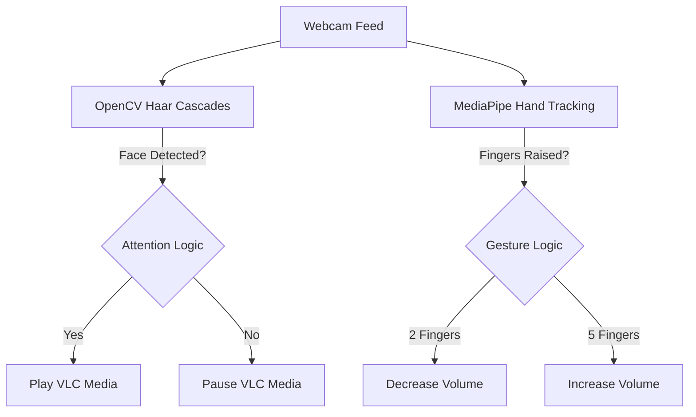

[](https://python.org)
[](https://opencv.org)
[](https://developers.google.com/mediapipe)
[]()

# 🖐️ Gesture-Controlled Media Player

### Real-time Computer Vision · Facial Detection · Gesture Interaction

*A Python-based contactless media player that automatically pauses when you look away and responds to hand gestures to adjust volume and playback.*

---

## 📋 Table of Contents

- [🚀 What This Project Does](#-what-this-project-does)
- [🏗️ Architecture](#%EF%B8%8F-architecture)
- [✨ Key Features](#-key-features)
- [📁 Project Structure](#-project-structure)
- [⚡ Quick Start](#-quick-start)
- [📦 Dependencies](#-dependencies)

---

## 🚀 What This Project Does

This project integrates real-time computer vision with VLC Media Player to create a completely contactless viewing experience. Using a standard webcam, the system performs two main tasks simultaneously:

1. **Facial Tracking (Attention Detection):** The video plays only when a face is detected in the frame. If the user looks away or leaves the room, the video automatically pauses.
2. **Gesture Recognition:** Using MediaPipe's hand-tracking framework, it maps specific hand poses (like raising two fingers) to system commands (like lowering the volume).



---

## 🏗️ Architecture

### 1. Vision Pipeline

The application captures frames via `cv2.VideoCapture`. To optimize performance on standard CPUs:
- Frames are converted to grayscale for facial detection using `haarcascade_frontalface_default.xml`.
- MediaPipe is utilized for robust, multi-hand landmark detection.

### 2. State Management

A state machine continuously monitors the output from the vision pipeline:
- **Consistent Frame Buffer:** Gestures are only registered if they are held consistently across multiple frames (e.g., 5+ consecutive frames of a 2-finger gesture) to prevent jitter and accidental triggers.
- **Media Controller:** Interfaces directly with `python-vlc` bindings to send hardware-level media commands without requiring window focus.

---

## ✨ Key Features

- **👀 Attention-Aware Playback:** Never miss a scene. Video pauses the millisecond your face leaves the frame.
- **🖐️ Contactless Volume Control:** Adjust volume silently using hand gestures.
- **⚡ Low-Latency Processing:** Optimized Haar cascades ensure the detection loop runs at real-time FPS on standard consumer hardware.
- **🛡️ Fault-Tolerant Setup:** Graceful error handling for missing webcams, corrupted video files, or VLC backend failures.

---

## 📁 Project Structure

```text
Gesture_Media_Player/
├── Gesture_Media_Player.ipynb     # Main application logic & vision loop
├── haarcascade_frontalface_default.xml # Pre-trained OpenCV facial weights
└── README.md                      # This documentation
```

*(Note: Requires a `sample.mp4` video file in the root directory to run the demonstration).*

---

## ⚡ Quick Start

### 1️⃣ Clone & Setup

```bash
git clone https://github.com/MedhaMasanam/Gesture_Media_Player.git
cd Gesture_Media_Player
```

### 2️⃣ Install Requirements

Ensure you have a working installation of [VLC Media Player](https://www.videolan.org/vlc/) on your system, as this project relies on its underlying libraries.

```bash
pip install opencv-python numpy python-vlc mediapipe pyautogui
```

### 3️⃣ Run the Application

Place any video file named `sample.mp4` into the project directory, then execute the notebook cells. The webcam window will launch automatically. 

- **Look at the camera** to start playback.
- **Look away** to pause.
- **Raise 2 fingers** to lower the volume.
- Press **'q'** in the OpenCV window to safely terminate the process.

---

## 📦 Dependencies

| Package | Version | Purpose |
|---------|---------|---------|
| `opencv-python` | ≥ 4.0 | Webcam capture, Haar cascades, Grayscale conversion |
| `mediapipe` | ≥ 0.10 | Robust hand landmark detection and pose estimation |
| `python-vlc` | ≥ 3.0 | Headless media playback and control |
| `numpy` | ≥ 1.21 | Matrix manipulation for frame arrays |

---
**Developed by Medha Masanam**  
[]()
